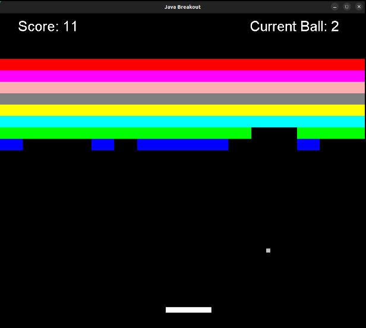

# JavaBreakout
A simple Breakout game written in Java

### Build Requirements:

 - Java 21
 - Maven

The [pom.xml](pom.xml) file can be adjusted to build with earlier versions of Java, but it is not recommended to go below 17.

### Build command

    mvn clean install

### Run

    java -jar target/javabreakout-0.0.1-SNAPSHOT-jar-with-dependencies.jar
